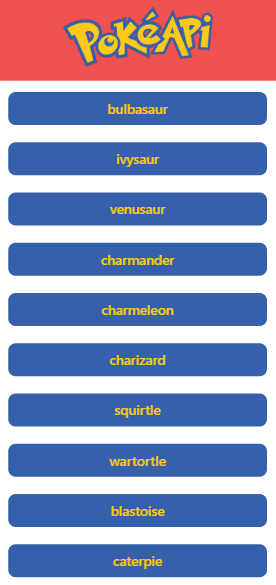
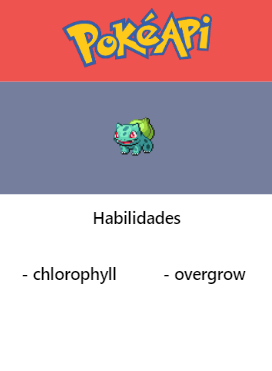

# App de Pokemon

App de Pokemon integrada con la API https://pokeapi.co/

[Ver la aplicación](https://app-pokemon.georgerangelcode.now.sh/)

## ¿Cómo funciona?

Requiere Node.JS 10

- `npm install` para instalar las dependencias.
- `npm run dev` para el entorno de desarrollo.
- `npm run build && npm start` para el entorno de producción.

## Licencia

MIT
